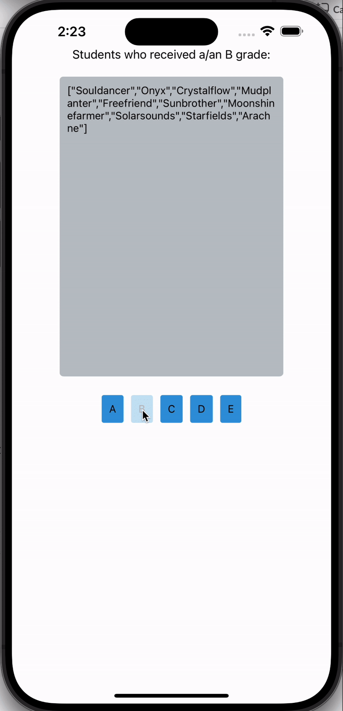

# Grade Fetching App

This React Native application extends the functionality of the previously built "buttons" app by implementing an interactive feature to fetch and display student grades.

## Features

- **Grade Selection**: Users can select from five buttons, labeled A through E, to fetch data corresponding to the grades.
- **Asynchronous Data Fetching**: The app makes asynchronous calls to a specified API endpoint, appending the chosen grade to the URL query string.
- **Dynamic Results Display**: The app dynamically updates to show the list of students who received the selected grade, each name appearing on its own line.
- **Responsive Layout**: Adjustments have been made to ensure the list of students is displayed in a scrollable view with a constrained height for improved user experience.

## Demonstration

Brief demonstartion of App:

## Usage

Upon launching the app, the user will see a header text and five buttons at the bottom of the screen. By pressing any of these buttons, the app will make a network request and then display the names of students who have received the respective grade above the buttons.

## Note

This application is intended for educational purposes as a part of a suite of React Native exercises. It builds upon the core features developed in the "buttons" app, which is located at `../buttons`. The focus of this extension is to showcase asynchronous API interaction and dynamic UI updates within a mobile application.
