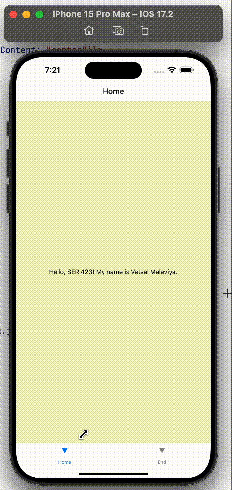

# Basic App

The `basic-app` is the first application in a series of projects developed for mastering fundamental concepts in mobile app development. This app features a simple two-view navigation using a bottom tab navigator.

## Features

- **Home View**: Displays a greeting message along with the developer's name.
- **End View**: A simple closing message thanking the user for using the app.

## Preview

Here's a quick look at the `basic-app` in action:

## Layout

The app utilizes a `flex` layout for centering content and applies distinct background colors to each view for visual differentiation.

## Navigation

The bottom tab navigator facilitates smooth transitions between the Home and End views, providing a user-friendly navigation experience.
